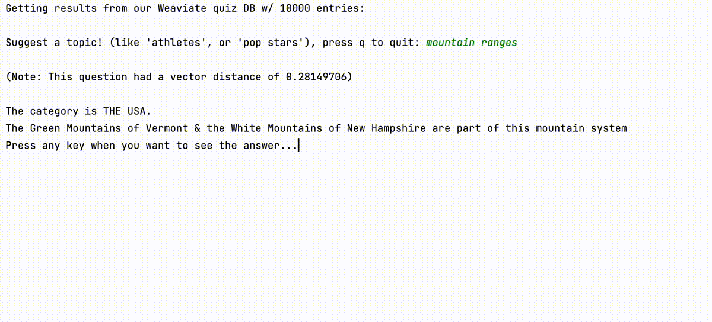
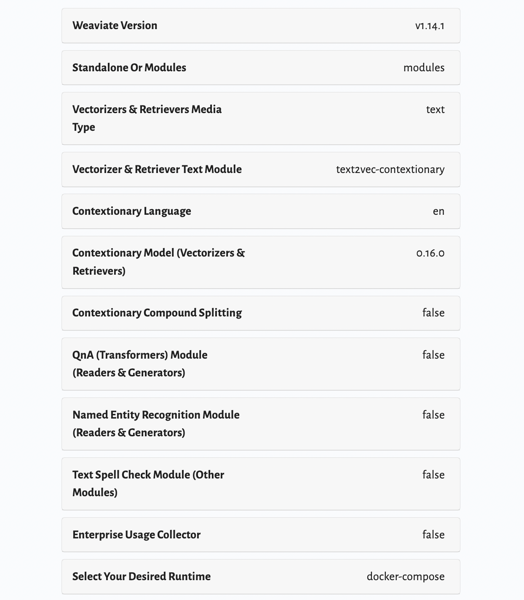

# Getting started with Weaviate and Python
### Learn by building a quiz program!
In this demo, we will show you how to build an intelligent search engine with Weaviate. By the end of the demo, you will have built a quiz app like below, where you can search for a topic of your preference, and test your skills against real questions from Jeopardy!



## Introduction

Let’s start with a simple analogy. Imagine going to a shop and asking if they had any fruit. If the shop had any apples, bananas, strawberries, or mangoes, you would expect them to say yes. Yet, many computing search systems will effectively only tell us “yes” for items containing the word “fruit”. So they might return items like grapefruit, dragonfruit, Fruit Loops (not a fruit!), or even fruit flies (yuck!). As impressive as they are at some tasks, computers are also pretty dumb at others.

And the fact is, we don’t always know the exact words to search for, even when we have a good understanding of the concept. But a good vector search engine like Weaviate’s can make this a problem of the past.

### Tutorial Outline

In this tutorial, you will see first-hand how Weaviate can help you organise and sift through huge amounts of complex text information at speed.

First, we’ll show you first-hand how easily and quickly you can add large amounts of data to Weaviate. Then, we’ll take a look at different ways in which Weaviate empowers you to find the right information. We’ll take a look at how you can search data contained in Weaviate through its properties, as well as by Weaviate’s vector search capabilities.

By combining these two aspects, Weaviate lets you quickly find the information that you want, as well as discover relevant information that you might not have known about.

But before we get started, let’s talk briefly about what a vector search engine is. If you’re familiar with them - you can skip to the next section [LINK TO OR NAME OF THE NEXT SECTION].

### What is a vector search engine?

Simply put, a vector search engine allows searching based on conceptual similarities. You can probably imagine how this works. Think about words that sound nothing alike, but have very similar meanings. Word pairs like:

- “lift” and “elevator”
- “intersection” and “crossroads”, or
- “film” and “movie”.

Just as we understand their closeness in meaning, Weaviate’s vector database will too. This is what powers Weaviate’s “semantic” (i.e. meaning-based) search at its core.

This is a monumental improvement on traditional searching methods, where the only way to find relevant information is to match the exact keywords or phrases, or slight variations on them like typos or pluralisations.

Weaviate's technologies allow organisations to keep up with ever-growing volumes of data so that you can find and make use of the right information in a timely manner. What's more, it also helps you to discover related information that you might not even have known about.

Weaviate also includes a host of other features to convert your existing data to a searchable database with ease and speed. Let’s take a look.

## Building the Weaviate quiz machinary

Now let's populate a Weaviate database, which we will be using for our search example later on. For the purposes of this exercise, we’ll assume that you have set up a Weaviate instance by following the “[Installation](https://weaviate.io/developers/weaviate/current/getting-started/installation.html)” guide. The below is the setup which I used at the time of writing.


We will be using a [publicly available dataset](https://www.kaggle.com/datasets/tunguz/200000-jeopardy-questions) of questions and answers from the quiz show *Jeopardy*. If you are new to *Jeopardy*, it's a long-running American quiz show where the clue is in the form of an answer, and the contestants must identify the right question that the answer is related to.

> *Note: Could also use* [*https://www.kaggle.com/datasets/prondeau/350000-jeopardy-questions*](https://www.kaggle.com/datasets/prondeau/350000-jeopardy-questions?select=kids_teen.tsv)

In this section, we will show you how to:

- Create a database schema
- (Bulk) Import our data, and
- Verify the data

By the end of this section, you will have a Weaviate database full of impressive trivia from *Jeopardy*, ready for us to trawl through.

### Create a schema

First of all we need to define a schema, or structure, for the database. We’ll keep it fairly simple here.

Let’s build a schema consisting of just one object type (Question). And each Question will comprise at least of:

- category
- clue, and
- answer

So that we can later compile and run a quiz ourselves.

The schema definition in Python looks like this:

```python
schema = {
    "classes": [{
        "class": "Question",
        "description": "A Jeopardy! question with an answer",
        "properties": [
            {
                "dataType": ["string"],
                "description": "Category or topic of the question",
                "name": "category"
            },
            {
                "dataType": ["string"],
                "description": "Clue provided to the contestants",
                "name": "clue"
            },
            {
                "dataType": ["string"],
                "description": "The correct answer",
                "name": "answer"
            },
        ],
    }]
}
```

And then to create the schema, we simply need to establish a connection to the Weaviate instance via a client, and create the schema:

```python
import weaviate
client_uri = "http://localhost:8080"
client = weaviate.Client(client_uri)
client.schema.create(schema)
```

Once completed, you can go to `http://localhost:8080/v1/schema` to verify that the schema has been created.

Note that if there is an existing schema for the same name, it can be deleted by:

```python
client.schema.delete_class("Question")
```

> Note: An implementation of this section can be found in `1_create_schema.py` in the git repository.

We don’t yet have any data in our database yet, however. So let’s get to adding that.

### Import data

Weaviate offers multiple ways to add data to our database. Using the `client.data_object.create` method will allow addition of an individual object to the database.

For adding many data objects in bulk, you should use batch import methods as much as possible for the best performance. Bulk importing data is quite simple - we simply need to configure a few parameters for the batch importer:

```python
import weaviate
client_uri = "http://localhost:8080"

client.batch.configure(
    # `batch_size` takes an `int` value to enable auto-batching
    # (`None` is used for manual batching)
    batch_size=100,
    # dynamically update the `batch_size` based on import speed
    dynamic=False,
    # `timeout_retries` takes an `int` value to retry on time outs
    timeout_retries=3,
    # checks for batch-item creation errors
    callback=None,
)
```

And then add data objects to the batch importer like so:

```python
# When using a vectoriser
batch.add_data_object(object_props, "Question")

# # When setting a custom vector
# batch.add_data_object(object_props, "Question", vector=YOUR_VECTOR_HERE)
```

Where o`bject_props` is a dictionary of properties corresponding to the schema, such as “category", "clue" and “answer".

This way, Weaviate’s batch importer will be able to perform the vectorisation as well as database object creation in batches. Running this function will begin to populate our database with the quiz items.

We note that for GPU-intensive vectorisers such as transformer models, you should enable GPU support as it will lead to significant performance increases.

Once our data import is complete, we can check the size of our database with a simple aggregate query such as this:

```python
client = weaviate.Client("http://localhost:8080")
result = client.query.aggregate("Question").with_fields('meta { count }').do()
print(result)
```

This should now tell us how many "Question" objects are in our database, which we can use to verify success of the import process.

Once completed, you can go to `http://localhost:8080/v1/objects` to take a look at a few Question objects.

Now we are ready to search through the database, and even play a few rounds of trivia!

> Note: An implementation of this section can be found in `2_import_data.py` in the git repository. The script is by default set up to only import the first 10,000 rows - you can remove that limit by commenting out the `limit = 10000` line.

### Run a search (i.e. shall we play a game?)

By now, we should have:

- Created a schema to contain our trivia question (“Question”) objects, and
- Imported a set of questions to populate our database.

So we are ready to make queries to our database. And going further, we will use the our newly-constructed Weaviate database to play a little game of trivia.

Weaviate allows for a combination of “scalar” and “vector” searches. For now, let's take a look at a simple vector search.

The `client.query.get` function provides a simple interface to perform searches. Let's say that we would like to find questions related to history; perhaps history of a European nation, or Europe in general.

You might run a query like this:

```python
results = client.query.get(
    class_name="Question",
    properties=["category", "clue", "answer"]
).with_limit(5).with_near_text({
    "concepts": ["european history"]
}).do()
```

The below is one example set of answers:

```python
{'answer': 'Istanbul', 'category': 'EU, THE EUROPEAN UNION', 'clue': 'Each year the EU selects capitals of culture; one of the 2010 cities was this Turkish "meeting place of cultures"'}
{'answer': 'Baltic', 'category': 'FROM B TO C', 'clue': 'Branch of the Indo-European family of languages'}
{'answer': 'Italy', 'category': 'EUROPE', 'clue': '19th century Sardinia took the lead in unifying this country'}
{'answer': 'Europe', 'category': 'THE CONTINENTS', 'clue': 'In 1957 countries on this continent signed a treaty creating an economic community, or common market'}
{'answer': 'the Ottoman Empire', 'category': 'THE 19th CENTURY', 'clue': 'One of the 3 large empires of 19th century Eastern Europe was this "Sick Man"'}
```

Notice that all questions are relevant, however not many would have been found by scalar searches of the words “european” and “history”. This is the power of vector searching.

Instead of finding the lemma of the word “history” to capture all words like "history", “historical” and "historic”, we can simply perform a search for the phrase “european history”, and it will find related entries.

Weaviate can also return the vector “distance” between the query and the returned objects, such that you can review how similar the resulting hits are, or set a threshold for the objects to be viewed.

```python
results = client.query.get(
    class_name="Question",
    properties=["category", "clue", "answer"]
).with_limit(5).with_near_text({
    "concepts": ["european history"]
}).with_additional(
    ['id', 'distance']
).do()
```

And the resulting output might look like this:

```python
{'_additional': {'distance': 0.17267555}, 'answer': 'Istanbul', 'category': 'EU, THE EUROPEAN UNION', 'clue': 'Each year the EU selects capitals of culture; one of the 2010 cities was this Turkish "meeting place of cultures"'}
{'_additional': {'distance': 0.18340677}, 'answer': 'Baltic', 'category': 'FROM B TO C', 'clue': 'Branch of the Indo-European family of languages'}
{'_additional': {'distance': 0.2152527}, 'answer': 'Italy', 'category': 'EUROPE', 'clue': '19th century Sardinia took the lead in unifying this country'}
{'_additional': {'distance': 0.2170096}, 'answer': 'Europe', 'category': 'THE CONTINENTS', 'clue': 'In 1957 countries on this continent signed a treaty creating an economic community, or common market'}
{'_additional': {'distance': 0.22707671}, 'answer': 'the Ottoman Empire', 'category': 'THE 19th CENTURY', 'clue': 'One of the 3 large empires of 19th century Eastern Europe was this "Sick Man"'}
```

This means that where there are no or very few search results, the user can be alerted to this fact, or simply not be shown poorly matching results, rather than being shown substandard outputs.

Using these results, we can build our own trivia game - we can simply take an input from a user, and construct a query which will return a set of Question objects.

```python
import weaviate
client = weaviate.Client("http://localhost:8080")

def get_question(client, n_questions=5):

    results = client.query.get(
        class_name=question_class,
        properties=["category", "clue", "answer"]
    ).with_limit(5).with_near_text({
        "concepts": [category_query]
    }).with_additional(
        ['distance']
    ).do()

    return results

user_query = input("Suggest a topic!: ")
results = get_question(client, category_query=user_query)
```

Where the returned objects are saved on to the `results` variable.

From this point on, it is simply a matter of rearranging the returned collection of data to construct a quiz. To add a little bit of variety, we’ll add a randomiser which will choose between a number of candidate questions:

```python
def build_question(questions):

    import random
    question = random.choice(questions)

    print(f"\nThe category is {question['category']}.")
    print(f"{question['clue']}")

    input("Press any key when you want to see the answer...")

    print(f"{question['answer']}")

    return True
```

This function, called as `build_question(results)`  using the output from above, will return an interactive quiz such as this:

```python
Suggest a topic! (like 'athletes', or 'pop stars'), press q to quit: european history

(Note: This question had a vector distance of 0.18340677)

The category is FROM B TO C.
Branch of the Indo-European family of languages
Press any key when you want to see the answer...
```

Where upon pressing a key, you should see:

```python
Baltic
```

Note again that although the word “history” doesn’t appear in the question, Weaviate was able to identify that the substance of the question was related.

You can imagine that this can be combined with a scalar search - to fix a category, to filter for quizzes from a particular round (e.g. Final Jeopardy).

And hopefully you can begin to see how a Weaviate-powered database can help you to search through, and explore your data.

We encourage you to follow the tutorial yourself, and to play a few rounds of the quiz - whether by yourself or with a few friends.. We think this will give you an interesting introduction to Weaviate, and hopefully have a bit of fun too.

> Note: An implementation of this section can be found in `3_run_queries.py` in the git repository.

Thanks for reading, and see you next time!
